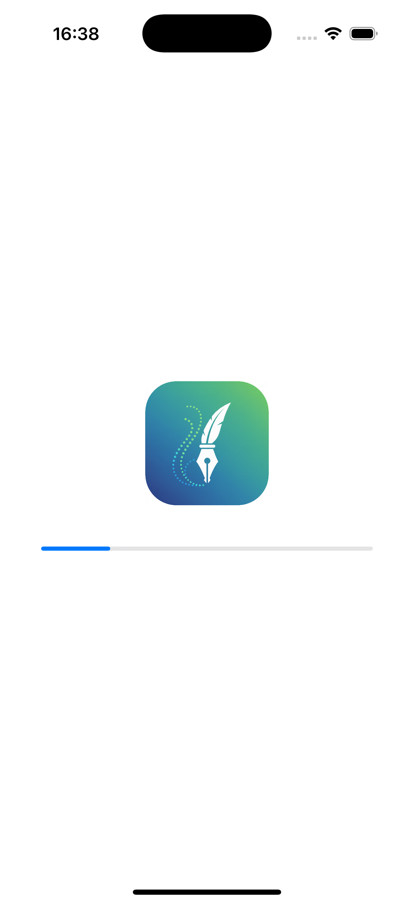

# 🔐 Authentication Flow (SwiftUI)

Authentication module built with **SwiftUI**.  
This project includes UI, navigation, and validation logic for Splash, Login, and Sign Up screens.

## 📱 Features

- SwiftUI based UI
- Navigation between screens
- Input validations
- Clean and simple authentication flow

---

## 🚀 Task: Authentication

### General Instructions

- UI + Navigation + Validations only
- Built using **SwiftUI**
- No backend integration
- Focus on correct user flow and validations

---

## 🖼 Screens

**Screenshots:**

  
  
  

### 1️⃣ Splash Screen

**Description:**
- App logo centered horizontally and vertically
- Progress indicator below logo (~30px spacing)
- 3-second timer on load
- Automatic navigation to Login Screen after 3 seconds

---

### 2️⃣ Login Screen

**UI Elements:**
- Email text field
- Password text field
- Login button
- Forgot Password button
- Text at bottom:  
  _"Don’t have an account? Sign Up"_ (tappable)

**Navigation:**
- Tap **Sign Up** → Navigate to Sign Up Screen

---

### 3️⃣ Sign Up Screen

**UI Elements:**
- Name text field
- Email text field
- Password text field
- Confirm Password text field
- Sign Up button
- Text below button:  
  _"Already have an account? Login"_ (tappable)

**Validations:**
- All fields must not be empty
- Email must be valid format
- Password and Confirm Password must match

**Navigation:**
- If validation passes → Navigate to Home Screen
- Tap **Login** → Navigate back to Login Screen

---

## ✅ Validations

- Required fields validation
- Email format validation
- Password match validation
- Navigation only if validations pass

---

## 🛠 Technologies

- Swift
- SwiftUI
- NavigationStack
- State & Binding for form handling

---

## 📂 Project Structure

- SplashScreen
- LoginScreen
- SignUpScreen
- HomeScreen
- Navigation & Routes

---

## 👤 Author

Developed by **Nadira Seitkazy**  
Junior iOS Developer  
SwiftUI | iOS | Mobile Development
